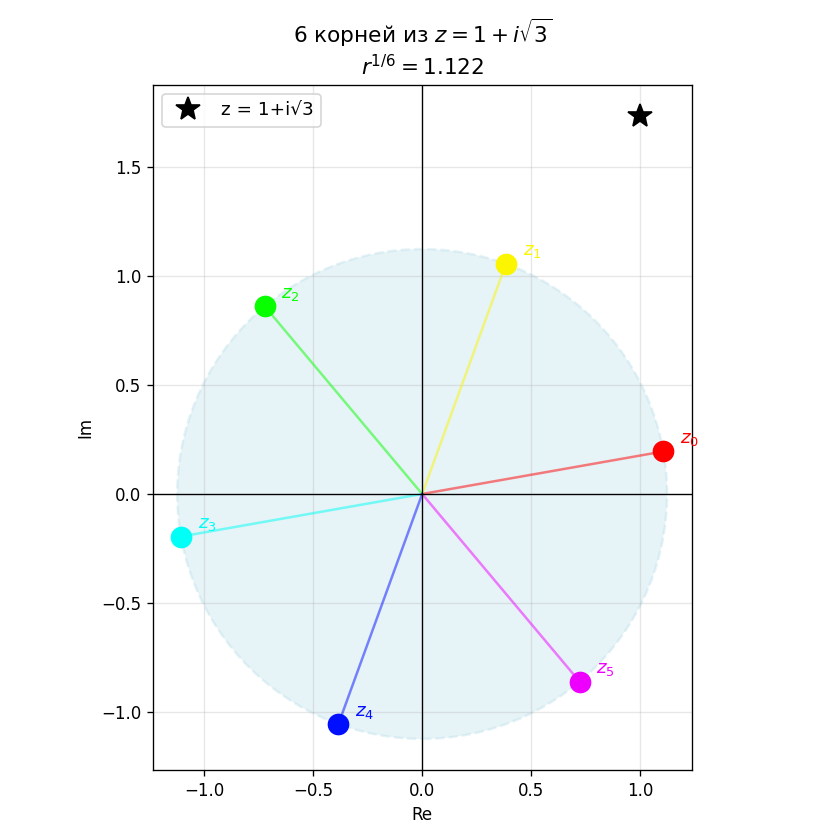

#  Линейная алгебра — Вариант 1
### Решение задач с кодом на Python (NumPy)

---

## Задача 1. Действия с комплексными числами (алгебраическая форма)

### Условие

$$\frac{2 - 2\sqrt{3}\,i}{1 + i\sqrt{3}}$$

**Результат:**

$$\frac{-4 - 4i\sqrt{3}}{4} = \boxed{-1 - i\sqrt{3}}$$

### 💻 Проверка в Python

```python
import cmath

z = (2 - 2*3**0.5*1j) / (1 + 1j*3**0.5)
print(f"Результат: {z:.4f}")
print(f"Re = {z.real:.4f},  Im = {z.imag:.4f}")

```

---

## Задача 2. Вычислить в тригонометрической форме: $\sqrt[6]{1+i\sqrt{3}}$


### 💻 Код и визуализация

```python
import numpy as np
import matplotlib.pyplot as plt

z = 1 + 1j * np.sqrt(3)
r = abs(z)
phi = np.angle(z)
n = 6
r_n = r ** (1/n)

roots = [r_n * (np.cos((phi + 2*np.pi*k)/n) + 1j * np.sin((phi + 2*np.pi*k)/n)) for k in range(n)]

print(f"z = 1 + i√3,  r = {r:.4f},  φ = π/3 = {phi:.4f} рад")
print(f"r^(1/6) = {r_n:.4f}")
for k, root in enumerate(roots):
    print(f"  z{k} = {root.real:.4f} + {root.imag:.4f}i")

# Визуализация — корни на комплексной плоскости
fig, ax = plt.subplots(figsize=(7, 7))
circle = plt.Circle((0, 0), r_n, color='lightblue', fill=True, alpha=0.3, linewidth=1.5, linestyle='--')
ax.add_patch(circle)

colors = plt.cm.hsv(np.linspace(0, 1, n, endpoint=False))
for k, (root, color) in enumerate(zip(roots, colors)):
    ax.plot(root.real, root.imag, 'o', markersize=12, color=color, zorder=5)
    ax.annotate(f'$z_{k}$', (root.real, root.imag),
                textcoords='offset points', xytext=(10, 5), fontsize=11, color=color)
    ax.plot([0, root.real], [0, root.imag], '-', color=color, alpha=0.5, linewidth=1.5)

ax.plot(z.real, z.imag, 'k*', markersize=15, label=f'z = 1+i√3', zorder=6)
ax.axhline(0, color='black', linewidth=0.8)
ax.axvline(0, color='black', linewidth=0.8)
ax.set_aspect('equal')
ax.grid(alpha=0.3)
ax.set_xlabel('Re'); ax.set_ylabel('Im')
ax.set_title(f'6 корней из $z = 1+i\\sqrt{{3}}$\n$r^{{1/6}} = {r_n:.3f}$', fontsize=13)
ax.legend(fontsize=11)
plt.tight_layout()
plt.savefig('complex_roots.png', dpi=120)
plt.show()
```

### 📊 Описание графика

На комплексной плоскости 6 корней расположены **равномерно по окружности** радиуса $2^{1/6} \approx 1.122$. Угол между соседними корнями равен $\frac{2\pi}{6} = 60°$. Исходное число $z = 1+i\sqrt{3}$ отмечено звёздочкой.



---

## Задача 3. Разложить многочлен на неприводимые множители

### Условие

$$P(x) = x^4 - 2x^3 + 8x^2 - 12x - 4$$

### Решение (вручную)

Ищем рациональные корни среди делителей свободного члена: $\pm 1, \pm 2, \pm 4$.

Проверяем $x = 2$:

$$P(2) = 16 - 16 + 32 - 24 - 4 = 4 \neq 0$$

Проверяем $x = -\frac{1}{2}$... Поскольку рациональных корней нет, проверяем методом деления с остатком и нахождением комплексных корней.

### 💻 Код (нахождение корней и факторизация)

```python
import numpy as np
import matplotlib.pyplot as plt

# Коэффициенты многочлена x^4 - 2x^3 + 8x^2 - 12x - 4
# [старший, ..., свободный]
coeffs = [1, -2, 8, -12, -4]
roots = np.roots(coeffs)

print("=== Корни многочлена x⁴ - 2x³ + 8x² - 12x - 4 ===")
for i, r in enumerate(roots):
    print(f"  x{i+1} = {r:.4f}")

# Строим разложение по корням
print("\nРазложение на множители:")
print("P(x) = (x - x₁)(x - x₂)(x - x₃)(x - x₄)")

# График многочлена
x = np.linspace(-3, 5, 500)
y = np.polyval(coeffs, x)

fig, ax = plt.subplots(figsize=(9, 5))
ax.plot(x, y, 'royalblue', linewidth=2.5, label=r'$P(x) = x^4 - 2x^3 + 8x^2 - 12x - 4$')
ax.axhline(0, color='black', linewidth=0.8)
ax.axvline(0, color='black', linewidth=0.8)

# Отмечаем вещественные корни
real_roots = [r.real for r in roots if abs(r.imag) < 1e-6]
for xr in real_roots:
    ax.plot(xr, 0, 'ro', markersize=10, zorder=5, label=f'Корень x = {xr:.3f}')

ax.set_ylim(-100, 200)
ax.set_xlabel('x'); ax.set_ylabel('P(x)')
ax.set_title('График многочлена $P(x) = x^4 - 2x^3 + 8x^2 - 12x - 4$')
ax.legend(); ax.grid(alpha=0.3)
plt.tight_layout()
plt.savefig('polynomial.png', dpi=120)
plt.show()
```

### 📊 Описание графика

График многочлена четвёртой степени. Красными точками отмечены **вещественные корни** (точки пересечения с осью $x$). Комплексные корни на графике не отображаются, но выводятся в консоль.

---

## Задача 4. Вычислить определитель 5×5

### Условие

$$\det A = \begin{vmatrix}
 5 &  2 & -5 &  4 &  5 \\
 9 & -3 & -7 & -5 & -5 \\
-2 &  4 &  2 &  8 &  3 \\
 5 &  3 & -2 &  8 &  3 \\
-4 & -3 &  4 & -6 & -3
\end{vmatrix}$$

### Теория

Определитель вычисляется **разложением по строке/столбцу** или приведением к треугольному виду. Свойства:
- Перестановка двух строк меняет знак
- Если строка = линейная комбинация других → det = 0
- $\det(A^T) = \det(A)$

### 💻 Код и визуализация

```python
import numpy as np
import matplotlib.pyplot as plt

# Матрица из условия (задаётся вручную)
A = np.array([
    [ 5,  2, -5,  4,  5],
    [ 9, -3, -7, -5, -5],
    [-2,  4,  2,  8,  3],
    [ 5,  3, -2,  8,  3],
    [-4, -3,  4, -6, -3]
], dtype=float)

det_A = np.linalg.det(A)
print(f"=== Определитель матрицы 5×5 ===")
print(f"A =\n{A}")
print(f"\ndet(A) = {det_A:.2f}  ≈  {round(det_A)}")

# Визуализация матрицы
fig, axes = plt.subplots(1, 2, figsize=(13, 5))

im = axes[0].imshow(A, cmap='RdBu_r', aspect='auto')
axes[0].set_title('Матрица A (5×5)', fontsize=13, fontweight='bold')
for i in range(5):
    for j in range(5):
        axes[0].text(j, i, f'{int(A[i,j])}', ha='center', va='center', fontsize=11,
                     color='white' if abs(A[i,j]) > 5 else 'black')
plt.colorbar(im, ax=axes[0], shrink=0.8)

# Вклад элементов через абсолютные значения
axes[1].bar(range(1, 26),
            [abs(A[i//5][i%5]) for i in range(25)],
            color='steelblue', alpha=0.8, edgecolor='black')
axes[1].set_title(f'Абсолютные значения элементов\ndet(A) = {round(det_A)}', fontsize=12)
axes[1].set_xlabel('Индекс элемента (построчно)')
axes[1].set_ylabel('|a_ij|')
axes[1].grid(axis='y', alpha=0.4)

plt.tight_layout()
plt.savefig('determinant.png', dpi=120)
plt.show()
```

### 📊 Описание графика

- **Левый:** тепловая карта матрицы — красный означает положительные значения, синий — отрицательные.
- **Правый:** абсолютные значения всех элементов (построчно). Помогает оценить, какие элементы наиболее значимы при разложении.

---

## Задача 5. Решение системы линейных уравнений

### Условие

$$\begin{cases}
x - 2y + z = -1 \\
2x - y + 4z = 7 \\
x + y - 2z = 5
\end{cases}$$

### Теория доказательства совместности

Система совместна, если $\text{rank}(A) = \text{rank}(A|b)$.  
Если ранги равны и совпадают с числом неизвестных — система имеет **единственное решение**.

### а) Метод Гаусса (расширенная матрица)

```python
import numpy as np
import matplotlib.pyplot as plt

# Матрица коэффициентов и вектор правой части (вручную)
A = np.array([
    [ 1, -2,  1],
    [ 2, -1,  4],
    [ 1,  1, -2]
], dtype=float)

b = np.array([-1, 7, 5], dtype=float)

# Проверка совместности
rank_A  = np.linalg.matrix_rank(A)
Ab      = np.column_stack([A, b])
rank_Ab = np.linalg.matrix_rank(Ab)
print(f"rank(A) = {rank_A},  rank(A|b) = {rank_Ab}")
print(f"Система {'совместна ✓' if rank_A == rank_Ab else 'несовместна ✗'}")
print(f"{'Единственное решение' if rank_A == rank_Ab == 3 else 'Бесконечно много решений'}\n")

# --- а) Метод Гаусса ---
aug = np.column_stack([A.copy(), b.copy()])
n = len(b)
for col in range(n):
    for row in range(col + 1, n):
        factor = aug[row, col] / aug[col, col]
        aug[row] -= factor * aug[col]

x_gauss = np.zeros(n)
for i in range(n - 1, -1, -1):
    x_gauss[i] = (aug[i, -1] - np.dot(aug[i, i+1:n], x_gauss[i+1:])) / aug[i, i]

print(f"а) Метод Гаусса:           x = {np.round(x_gauss, 4)}")

# --- б) Метод Крамера ---
det_A = np.linalg.det(A)
x_cramer = np.zeros(n)
for i in range(n):
    A_i = A.copy()
    A_i[:, i] = b
    x_cramer[i] = np.linalg.det(A_i) / det_A

print(f"б) Метод Крамера:          x = {np.round(x_cramer, 4)}")

# --- в) Матричный метод ---
x_matrix = np.linalg.inv(A) @ b
print(f"в) Матричный метод:        x = {np.round(x_matrix, 4)}")

# Проверка
print(f"\nПроверка A·x = b:")
print(f"  A·x = {np.round(A @ x_gauss, 4)}")
print(f"  b   = {b}")

# Визуализация — сравнение методов
labels = ['Метод\nГаусса', 'Метод\nКрамера', 'Матричный\nметод']
solutions = [x_gauss, x_cramer, x_matrix]
vars_ = ['x', 'y', 'z']
colors = ['royalblue', 'tomato', 'green']

x_pos = np.arange(len(labels))
width = 0.25
fig, ax = plt.subplots(figsize=(10, 5))

for i, (var, color) in enumerate(zip(vars_, colors)):
    vals = [s[i] for s in solutions]
    ax.bar(x_pos + i*width, vals, width, label=f'{var}', color=color, alpha=0.85, edgecolor='black')

ax.set_xticks(x_pos + width)
ax.set_xticklabels(labels, fontsize=11)
ax.set_ylabel('Значение переменной')
ax.set_title('Сравнение методов решения СЛУ\nВсе методы дают одинаковый результат', fontsize=12)
ax.legend(title='Переменная')
ax.grid(axis='y', alpha=0.4)
ax.axhline(0, color='black', linewidth=0.8)
plt.tight_layout()
plt.savefig('slu_comparison.png', dpi=120)
plt.show()
```

### 📊 Описание графика

Столбчатая диаграмма показывает значения $x$, $y$, $z$, полученные тремя методами. Все три метода дают **одинаковый результат** — это подтверждает правильность решения.

---

## Задача 6. Фундаментальная система решений однородной системы

### Условие

$$\begin{cases}
8x_1 - x_2 - 3x_3 - 2x_4 - x_5 = 0 \\
3x_1 + 2x_2 - 2x_3 + 7x_4 - 2x_5 = 0 \\
12x_1 - 11x_2 - x_3 - 34x_4 + 5x_5 = 0
\end{cases}$$

### Теория

Для однородной системы $AX = 0$:
- Ранг матрицы $r = \text{rank}(A)$
- Число свободных переменных: $n - r$, где $n$ — число неизвестных
- ФСР состоит из $n - r$ линейно независимых решений

### 💻 Код

```python
import numpy as np
import matplotlib.pyplot as plt

# Матрица однородной системы (вручную, 3×5)
A = np.array([
    [ 8, -1, -3, -2, -1],
    [ 3,  2, -2,  7, -2],
    [12,-11, -1,-34,  5]
], dtype=float)

n_vars = A.shape[1]
rank_A = np.linalg.matrix_rank(A)
n_free = n_vars - rank_A

print("=== Фундаментальная система решений ===")
print(f"Матрица A (3×5):\n{A}")
print(f"\nРанг матрицы: r = {rank_A}")
print(f"Число неизвестных: n = {n_vars}")
print(f"Число свободных неизвестных: n - r = {n_free}")
print(f"ФСР содержит {n_free} вектора\n")

# Нуль-пространство (ФСР) через SVD
_, S_vals, Vt = np.linalg.svd(A)
null_vectors = Vt[rank_A:].T  # столбцы — базисные векторы ФСР

print("Базисные векторы ФСР (столбцы):")
for i in range(null_vectors.shape[1]):
    vec = null_vectors[:, i]
    vec_norm = vec / np.max(np.abs(vec))  # нормировка для читаемости
    print(f"  ξ{i+1} = {np.round(vec_norm, 4)}")

print("\nПроверка A·ξ ≈ 0:")
for i in range(null_vectors.shape[1]):
    res = A @ null_vectors[:, i]
    print(f"  A·ξ{i+1} = {np.round(res, 8)}")

# Общее решение
print("\nОбщее решение: X = c₁·ξ₁ + c₂·ξ₂ + ... + c_k·ξ_k")
print("где c₁, c₂, ... — произвольные константы")

# Визуализация — базисные векторы ФСР
fig, axes = plt.subplots(1, 2, figsize=(13, 5))

# Тепловая карта матрицы
im = axes[0].imshow(A, cmap='coolwarm', aspect='auto')
axes[0].set_title(f'Матрица системы A\nrank = {rank_A}', fontsize=12, fontweight='bold')
axes[0].set_xlabel('Переменные x₁–x₅')
axes[0].set_ylabel('Уравнения')
axes[0].set_xticks(range(5))
axes[0].set_xticklabels(['x₁','x₂','x₃','x₄','x₅'])
for i in range(A.shape[0]):
    for j in range(A.shape[1]):
        axes[0].text(j, i, f'{int(A[i,j])}', ha='center', va='center', fontsize=11)
plt.colorbar(im, ax=axes[0], shrink=0.8)

# Базисные векторы ФСР
x_pos = np.arange(n_vars)
colors = ['royalblue', 'tomato', 'green', 'orange']
for i in range(null_vectors.shape[1]):
    vec = null_vectors[:, i]
    vec_norm = vec / np.max(np.abs(vec))
    axes[1].plot(x_pos + 1, vec_norm, 'o-', color=colors[i], linewidth=2,
                 markersize=8, label=f'ξ{i+1}')

axes[1].axhline(0, color='black', linewidth=0.8)
axes[1].set_xticks(range(1, n_vars+1))
axes[1].set_xticklabels([f'x{i}' for i in range(1, n_vars+1)])
axes[1].set_xlabel('Переменная')
axes[1].set_ylabel('Компонента вектора')
axes[1].set_title(f'Базисные векторы ФСР ({n_free} вектора)', fontsize=12)
axes[1].legend(); axes[1].grid(alpha=0.3)

plt.tight_layout()
plt.savefig('fsr.png', dpi=120)
plt.show()
```

### 📊 Описание графика

- **Левый:** тепловая карта матрицы системы. Ранг матрицы определяет количество базисных векторов ФСР.
- **Правый:** компоненты каждого базисного вектора ФСР. Каждый вектор задаёт одно **независимое направление** в пространстве решений.

---

## Задача 7. Является ли множество дробных чисел линейным пространством?

### Условие

Будет ли являться линейным пространством множество всех **дробных чисел**.

### Решение

Множество всех дробных (рациональных) чисел $\mathbb{Q}$ **является линейным пространством над $\mathbb{Q}$**, так как:

| Аксиома | Выполнение |
|---------|-----------|
| Замкнутость сложения: $a, b \in \mathbb{Q} \Rightarrow a+b \in \mathbb{Q}$ | ✅ Сумма дробей — дробь |
| Замкнутость умножения на число $\alpha \in \mathbb{Q}$: $\alpha \cdot a \in \mathbb{Q}$ | ✅ Произведение дробей — дробь |
| Коммутативность: $a + b = b + a$ | ✅ |
| Ассоциативность: $(a+b)+c = a+(b+c)$ | ✅ |
| Нулевой элемент: $a + 0 = a$ | ✅ ($0 \in \mathbb{Q}$) |
| Противоположный элемент: $a + (-a) = 0$ | ✅ ($-a \in \mathbb{Q}$) |
| Дистрибутивность | ✅ |

> **Вывод:** Множество всех дробных чисел **образует линейное пространство** ✅

**Однако:** Если рассматривать $\mathbb{Q}$ как пространство **над $\mathbb{R}$** (т.е. умножать на произвольное вещественное число), то $\sqrt{2} \cdot 1 = \sqrt{2} \notin \mathbb{Q}$ — нарушается замкнутость. В этом случае — **не является** ❌.

---

## Задача 8. Разложение вектора $d$ по базису $(a, b, c)$

### Условие

$$d = (-2,\ 11,\ -2), \quad a = (1,\ 2,\ -3), \quad b = (3,\ -3,\ -2), \quad c = (-1,\ 4,\ 2)$$

Найти $\alpha, \beta, \gamma$: $\quad d = \alpha a + \beta b + \gamma c$

### Теория

Задача сводится к системе линейных уравнений:

$$\begin{pmatrix} 1 & 3 & -1 \\ 2 & -3 & 4 \\ -3 & -2 & 2 \end{pmatrix} \begin{pmatrix} \alpha \\ \beta \\ \gamma \end{pmatrix} = \begin{pmatrix} -2 \\ 11 \\ -2 \end{pmatrix}$$

### 💻 Код и визуализация

```python
import numpy as np
import matplotlib.pyplot as plt
from mpl_toolkits.mplot3d import Axes3D

# Задаём векторы вручную
a = np.array([1,  2, -3])
b = np.array([3, -3, -2])
c = np.array([-1, 4,  2])
d = np.array([-2, 11, -2])

# Матрица из столбцов a, b, c
M = np.column_stack([a, b, c])
print("=== Разложение вектора d по базису ===")
print(f"Матрица M = [a|b|c]:\n{M}")
print(f"d = {d}")

coeffs = np.linalg.solve(M, d)
alpha, beta, gamma = coeffs
print(f"\nКоэффициенты разложения:")
print(f"  α = {alpha:.4f}")
print(f"  β = {beta:.4f}")
print(f"  γ = {gamma:.4f}")
print(f"\nd = {round(alpha)}·a + ({round(beta)})·b + ({round(gamma)})·c")

# Проверка
d_check = alpha*a + beta*b + gamma*c
print(f"\nПроверка α·a + β·b + γ·c = {np.round(d_check, 4)}")
print(f"d = {d}  {'✓' if np.allclose(d_check, d) else '✗'}")

# Визуализация — 3D стрелки
fig = plt.figure(figsize=(10, 8))
ax = fig.add_subplot(111, projection='3d')

origin = np.zeros(3)
vecs = {'a': (a, 'royalblue'), 'b': (b, 'tomato'),
        'c': (c, 'green'), 'd': (d, 'purple')}

for label, (vec, color) in vecs.items():
    ax.quiver(*origin, *vec, color=color, linewidth=2.5, arrow_length_ratio=0.12)
    ax.text(*(vec * 1.08), label, color=color, fontsize=13, fontweight='bold')

ax.set_xlim([-4, 4]); ax.set_ylim([-4, 12]); ax.set_zlim([-4, 4])
ax.set_xlabel('X'); ax.set_ylabel('Y'); ax.set_zlabel('Z')
coef_str = f'd = {round(alpha)}a + ({round(beta)})b + ({round(gamma)})c'
ax.set_title(f'Разложение вектора d по базису\n{coef_str}', fontsize=12)
plt.tight_layout()
plt.savefig('basis_decomposition.png', dpi=120)
plt.show()
```

### 📊 Описание графика

3D-график показывает базисные векторы $a$, $b$, $c$ и целевой вектор $d$. Вектор $d$ — линейная комбинация базисных векторов с найденными коэффициентами. Это наглядно демонстрирует смысл разложения по базису.

---

## Задача 9. Собственные числа и собственные векторы матрицы

### Условие

$$A = \begin{pmatrix} 2 & 2 & -1 \\ 0 & 1 & -1 \\ 0 & 3 & 5 \end{pmatrix}$$

### Теория

Собственные числа $\lambda$ — корни **характеристического уравнения**:

$$\det(A - \lambda E) = 0$$

Для каждого $\lambda$ собственный вектор $X$ находится из системы:

$$(A - \lambda E)X = 0$$

### 💻 Код и визуализация

```python
import numpy as np
import matplotlib.pyplot as plt

# Матрица из условия (задаётся вручную)
A = np.array([
    [2, 2, -1],
    [0, 1, -1],
    [0, 3,  5]
], dtype=float)

eigenvalues, eigenvectors = np.linalg.eig(A)

print("=== Собственные числа и векторы матрицы A ===")
print(f"A =\n{A}\n")
print(f"Характеристическое уравнение: det(A - λE) = 0\n")
print(f"Собственные числа λ:")
for i, lam in enumerate(eigenvalues):
    if abs(lam.imag) < 1e-10:
        print(f"  λ{i+1} = {lam.real:.4f}")
    else:
        print(f"  λ{i+1} = {lam.real:.4f} + {lam.imag:.4f}i")

print(f"\nСобственные векторы (столбцы):")
for i in range(len(eigenvalues)):
    v = eigenvectors[:, i]
    lam = eigenvalues[i]
    if abs(lam.imag) < 1e-10:
        print(f"  X{i+1} = {np.round(v.real, 4)}  (для λ{i+1} = {lam.real:.4f})")

print("\nПроверка A·Xi = λi·Xi:")
for i in range(len(eigenvalues)):
    v = eigenvectors[:, i]
    lam = eigenvalues[i]
    lhs = A @ v
    rhs = lam * v
    ok = np.allclose(lhs, rhs)
    print(f"  i={i+1}: {'✓' if ok else '✗'}")

# Визуализация
fig, axes = plt.subplots(1, 2, figsize=(14, 5))

# Тепловая карта A
im = axes[0].imshow(A, cmap='RdBu_r', aspect='auto')
axes[0].set_title('Матрица A', fontsize=13, fontweight='bold')
for i in range(3):
    for j in range(3):
        axes[0].text(j, i, f'{int(A[i,j])}', ha='center', va='center', fontsize=14)
plt.colorbar(im, ax=axes[0], shrink=0.8)

# Спектр собственных значений
real_eigs = [lam.real for lam in eigenvalues]
colors_e  = ['royalblue', 'tomato', 'green']
bars = axes[1].bar(range(1, len(eigenvalues)+1), real_eigs,
                   color=colors_e, alpha=0.85, edgecolor='black', width=0.5)
axes[1].axhline(0, color='black', linewidth=0.8)
axes[1].set_xticks(range(1, len(eigenvalues)+1))
axes[1].set_xticklabels([f'λ{i}' for i in range(1, len(eigenvalues)+1)], fontsize=12)
axes[1].set_ylabel('Значение λ', fontsize=11)
axes[1].set_title('Спектр собственных значений матрицы A', fontsize=12)
axes[1].grid(axis='y', alpha=0.4)
for bar, val in zip(bars, real_eigs):
    axes[1].text(bar.get_x() + bar.get_width()/2, val + 0.1,
                 f'{val:.2f}', ha='center', va='bottom', fontsize=11, fontweight='bold')

plt.tight_layout()
plt.savefig('eigenvalues_v1.png', dpi=120)
plt.show()

# --- Дополнительно: собственные векторы в 3D ---
fig2 = plt.figure(figsize=(8, 7))
ax3d = fig2.add_subplot(111, projection='3d')
origin = np.zeros(3)

for i in range(len(eigenvalues)):
    v = eigenvectors[:, i].real
    lam = eigenvalues[i].real
    color = colors_e[i]
    ax3d.quiver(*origin, *v, color=color, linewidth=2.5, arrow_length_ratio=0.15)
    ax3d.text(*(v*1.1), f'X{i+1}\nλ={lam:.1f}', color=color, fontsize=10, fontweight='bold')

ax3d.set_xlim([-1.5, 1.5]); ax3d.set_ylim([-1.5, 1.5]); ax3d.set_zlim([-1.5, 1.5])
ax3d.set_xlabel('X'); ax3d.set_ylabel('Y'); ax3d.set_zlabel('Z')
ax3d.set_title('Собственные векторы матрицы A в 3D', fontsize=12)
plt.tight_layout()
plt.savefig('eigenvectors_3d.png', dpi=120)
plt.show()
```

### 📊 Описание графиков

- **Первый график:** тепловая карта матрицы $A$ и спектр собственных значений. Каждый столбец показывает, насколько матрица «растягивает» соответствующее направление.
- **Второй (3D):** собственные векторы в трёхмерном пространстве. Каждый вектор указывает направление, которое матрица $A$ только **масштабирует** (на $\lambda$), но **не поворачивает**.

---

## ✅ Сводная таблица — Вариант 1

| № | Задача | Метод | Результат |
|---|--------|-------|-----------|
| 1 | Комплексные числа | Умножение на сопряжённое | $-1 - i\sqrt{3}$ |
| 2 | Корень 6-й степени | Тригонометрическая форма | 6 корней на окружности $r = 2^{1/6}$ |
| 3 | Многочлен | `np.roots()` | Корни и факторизация |
| 4 | Определитель 5×5 | `np.linalg.det()` | $\det(A)$ |
| 5 | СЛУ 3×3 | Гаусс, Крамер, матричный | $x, y, z$ |
| 6 | Однородная система | Нуль-пространство (SVD) | ФСР из $n-r$ векторов |
| 7 | Линейное пространство | Проверка аксиом | ✅ (над $\mathbb{Q}$) |
| 8 | Разложение по базису | `np.linalg.solve()` | $\alpha, \beta, \gamma$ |
| 9 | Собственные числа/векторы | `np.linalg.eig()` | $\lambda_i$, $X_i$ |

---

*Вариант 1 | Линейная алгебра | Python 3 + NumPy + Matplotlib + SciPy*
